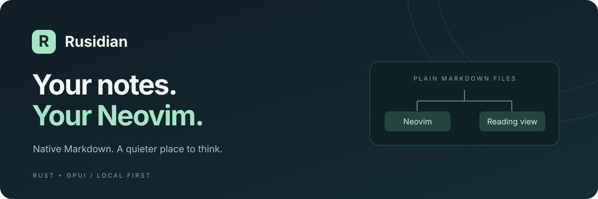

<p align="center">
  
</p>

<p align="center"><strong>用真正的 Neovim 写作，在原生阅读视图中看见你的想法。</strong></p>

<p align="center">
  <a href="https://github.com/AlbertHuangT/rusidian/actions/workflows/ci.yml"></a>
  
  
  
</p>

<p align="center">
  <a href="#为什么是-rusidian">为什么是 Rusidian</a> ·
  <a href="#快速开始">快速开始</a> ·
  <a href="#日常操作">日常操作</a> ·
  <a href="#当前进度">当前进度</a> ·
  <a href="PRODUCT.md">产品方向</a>
</p>

---

Rusidian 是一个**本地优先的原生 Markdown 桌面应用**。它将你本机的 Neovim 与独立的阅读视图连接起来：源码交给熟悉的编辑器，排版、图片和 TikZ 交给 Rust 与 GPUI。

> **正在构建，欢迎试用原型。** 当前以 Apple Silicon macOS 为验证平台，尚不是可替代日常笔记软件的稳定版本。已确认的产品取舍以 [PRODUCT.md](PRODUCT.md) 为准。

## 为什么是 Rusidian

### 真正的 Neovim，熟悉的写作方式

源码视图运行本机 `nvim --embed`，加载你的 Neovim 配置。Insert、Visual、命令行和用户映射由 Neovim 处理。阅读与源码在同一个窗口内切换，阅读视图读取内存中的 buffer，**无需先保存就能查看修改**。

### 给 Markdown 一个原生阅读空间

GPUI 负责窗口、文字和图像绘制，不使用 Electron 或 WebView。阅读视图已有标题、强调、代码、列表、表格和本地图片，配合 Vim 式移动、查找与选择，让阅读也能留在键盘上。

### 把 TikZ 留在笔记里

在 Markdown 的 `tikz` 代码块中写图，Tectonic 在后台生成 PDF，再转换成显示图像。编译失败显示块内错误；PDF 缓存位于系统缓存目录，上限为 64 MiB。普通 Markdown 不依赖 TeX 编译成功。

### 文件始终属于你

笔记保持为普通本地文件，不需要账号。笔记内容在本地处理，应用不上传遥测；远程图片当前不加载，缓存不写入笔记文件夹。同步交给你已有的 Git、Syncthing 或 iCloud 文件夹。

## 快速开始

需要 **Apple Silicon Mac、Xcode Command Line Tools、Rust 和 Neovim**。TikZ 与公式额外需要 Tectonic；首次编译可能联网下载 TeX 资源，离线使用前需准备好所需资源。

```sh
# 已有 Homebrew 和 rustup 的环境
brew install neovim tectonic
git clone https://github.com/AlbertHuangT/rusidian.git
cd rusidian
cargo run --locked -- examples/tikz.md
```

打开自己的笔记：

```sh
cargo run --locked -- /absolute/path/to/note.md
```

未安装编译工具时，先运行 `xcode-select --install`；Rust 安装方式见 [rustup](https://rustup.rs/)。仓库通过 `rust-toolchain.toml` 固定工具链，首次构建会下载依赖并编译 GPUI。

默认构建使用 GPUI 的运行时 Metal shader 编译路径，不需要独立 Metal 编译器。`--no-default-features` 构建需要 `xcrun metal` 和 `xcrun metallib`；该路径不在当前 CI 验证范围内。

## 日常操作

| 操作 | 按键 |
| :--- | :--- |
| 打开文件 | `⌘ O` |
| 阅读 → 源码 Normal | `Enter` |
| 源码 Normal → 阅读 | `Esc` |
| 阅读视图移动 | `h j k l`、`w b e`、`0 ^ $`、`gg G` |
| 翻页 | `Ctrl-d/u`、`Ctrl-f/b` |
| 查找 | `/ ?`、`n N`、`* #`、`f F t T` |
| 选择并复制 | `v` / `V`，然后 `y` |
| 打开光标处的内部 / 外部链接 | `gf` / `gx` |
| 保存文件 | 在 Neovim 中执行 `:w` |

切回阅读视图不会保存文件。换文件或从应用菜单退出时，Neovim 会拒绝丢弃未保存修改；先用 `:w` 保存，或自行用 `:q!` 放弃修改。当前检测到 Normal 模式的 `Esc` 映射冲突时只提示，应用仍优先使用该键切换视图。

TikZ 块写完整环境，外层文档由 Rusidian 补齐：

````markdown
```tikz
\begin{tikzpicture}
  \draw[->] (0,0) -- (3,0) node[right] {$x$};
  \draw[->] (0,0) -- (0,2) node[above] {$y$};
\end{tikzpicture}
```
````

更多内容见 [Markdown 示例](examples/markdown.md) 和 [TikZ 示例](examples/tikz.md)。当前 TikZ 模板加载 `tikz`，仅承诺 Tectonic 可处理的内容，不承诺完整 TeX Live 或任意宏包兼容。

## 当前进度

| 已有实现，可参与验证 | 尚未完成验收或仍在规划 |
| :--- | :--- |
| 单窗口文件打开、Neovim 嵌入、内存 buffer 预览 | 用户真实配置的完整兼容、阅读光标精确映射回源码 |
| 常见 Markdown / GFM 渲染、阅读导航与选择 | 完整 Obsidian 语义、屏幕折行导航、混合图文富文本复制 |
| TikZ、实验性行内 / 块级公式、PDF 缓存 | 编译触发时机、TeX 权限隔离与资源配置的完整闭环 |
| 原生 GPUI 窗口、中文预编辑接口 | 中文输入与字体的完整验收、系统主题跟随、性能指标 |

后续优先级是 vault、文件树、多文件标签和多窗口，再扩展全文搜索、wikilink、反向链接与 properties。**Linux 在后续计划中；Windows 不在支持目标内。**

HTML 按代码显示，Mermaid 保留源码；不执行 Obsidian 插件，也不承诺兼容其主题。应用体积、内存与启动速度目前仍是待测目标，不是已达成的性能宣传。

## 开发与构建

```sh
cargo fmt --all --check
cargo clippy --locked --all-targets -- -D warnings
cargo test --locked
# 需要本机 Neovim、Tectonic，以及 macOS 自带的 sips
cargo test --locked -- --ignored --test-threads=1
cargo build --locked --release
```

[GitHub Actions](https://github.com/AlbertHuangT/rusidian/actions/workflows/ci.yml) 在 macOS ARM64 上执行上述检查，并保留 7 天的压缩构建产物和 SHA-256 校验文件。版本标签 `v<版本号>` 与 Cargo 版本匹配且检查通过后，会创建 **draft prerelease**，供维护者检查后发布。

产物是需要外部 Neovim / Tectonic 的原型可执行文件，尚无签名、公证、`.app` 安装包或 Homebrew 发布。GPUI 固定到经过本地构建验证的 Zed Git 提交，不跟随浮动主分支。

## 参与

欢迎通过 [Issues](https://github.com/AlbertHuangT/rusidian/issues) 提交可复现的问题；附上 macOS、Neovim 版本、最小 Markdown 示例和操作步骤。修改前请阅读 [产品决定](PRODUCT.md)、[项目术语](CONTEXT.md) 和 [GPUI 架构决定](docs/adr/0001-use-gpui-for-gui.md)。

当前仓库尚未指定项目许可证。历史方案保留在 [PLAN.html](PLAN.html)，不代表当前实现承诺。
