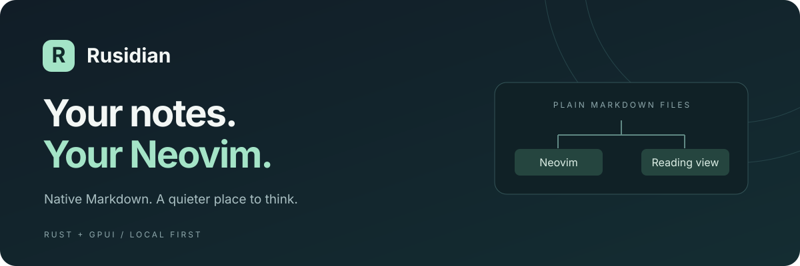

<p align="center">
  
</p>

<p align="center"><strong>用真正的 Neovim 写作，在原生阅读视图中看见你的想法。</strong></p>

<p align="center">
  <a href="https://github.com/AlbertHuangT/rusidian/actions/workflows/ci.yml"></a>
  
  
  
</p>

<p align="center">
  <a href="#为什么是-rusidian">为什么是 Rusidian</a> ·
  <a href="#快速开始">快速开始</a> ·
  <a href="#日常操作">日常操作</a> ·
  <a href="#当前进度">当前进度</a> ·
  <a href="PRODUCT.md">产品方向</a>
</p>

---

Rusidian 是一个**本地优先的原生 Markdown 桌面应用**。它将你本机的 Neovim 与独立的阅读视图连接起来：源码交给熟悉的编辑器，排版、图片和数学公式交给 Rust 与 GPUI，TikZ 交给 Tectonic。

> **正在构建，欢迎试用原型。** 当前以 Apple Silicon macOS 为验证平台，尚不是可替代日常笔记软件的稳定版本。已确认的产品取舍以 [PRODUCT.md](PRODUCT.md) 为准。

## 为什么是 Rusidian

### 真正的 Neovim，熟悉的写作方式

源码视图运行本机 `nvim --embed`，加载你的 Neovim 配置。Insert、Visual、命令行、鼠标和用户映射由 Neovim 处理。阅读与源码在同一个窗口内切换，阅读视图读取内存中的 buffer，**无需先保存就能查看修改**；两个视图的光标落在同一个字符上。在 Neovim 里 `:e` 其他文件、`:w` 新笔记或外部程序修改文件，阅读视图都会跟上；打开的笔记显示为标签，未保存的笔记可以留在后台。

### 给 Markdown 一个原生阅读空间

GPUI 负责窗口、文字和图像绘制，不使用 Electron 或 WebView。阅读视图已有标题、强调、代码、列表、表格、本地图片（支持 `![[图.png|200]]` 尺寸）、Obsidian 笔记与段落嵌入（`![[笔记#标题]]`）、脚注、callout、`==高亮==`、属性（front matter），配合 Vim 式移动、查找与选择，让阅读也能留在键盘上；点击可以放置光标或打开链接。阅读视图默认跟随系统亮色 / 暗色，也可以在设置中固定。

### 把 TikZ 留在笔记里

在 Markdown 的 `tikz` 代码块中写图，Tectonic 在后台生成 PDF，再转换成显示图像：写完闭合围栏即开始编译，修改已有图形则在光标离开该块后重新编译。编译失败显示块内错误；PDF 缓存位于系统缓存目录，上限为 64 MiB。普通 Markdown 不依赖 TeX 编译成功。全局和每个 vault 的 TeX 前导内容可在设置中用 Neovim 编辑，保存在系统设置目录。

### 文件始终属于你

笔记保持为普通本地文件，不需要账号。笔记内容在本地处理，应用不上传遥测；远程图片默认不加载，可以单次加载或允许某个 vault 自动加载；缓存与设置不写入笔记文件夹。同步交给你已有的 Git、Syncthing 或 iCloud 文件夹。

## 快速开始

需要 **Apple Silicon Mac 和 Neovim**。只有 TikZ 额外需要 Tectonic；普通公式由 GPUI 原生绘制，不启动 TeX 进程。TikZ 首次编译可能联网下载 TeX 资源，离线使用前需准备好所需资源。

Homebrew 一行安装滚动 nightly（会自动添加本仓库为 tap）：

```sh
brew tap AlbertHuangT/rusidian https://github.com/AlbertHuangT/rusidian && brew install --cask rusidian
```

也可以从 [GitHub Releases](https://github.com/AlbertHuangT/rusidian/releases) 下载 Apple Silicon DMG，把 `Rusidian.app` 拖入“应用程序”。当前构建使用 ad-hoc 签名、尚未 Apple 公证；首次启动可能需要在访达中右键应用并选择“打开”。更新包另有内置公钥签名验证。

从源码运行需要 **Xcode Command Line Tools 和 Rust**：

```sh
# 已有 Homebrew 和 rustup 的环境
brew install neovim tectonic
git clone https://github.com/AlbertHuangT/rusidian.git
cd rusidian
cargo run --locked -- examples/tikz.md
```

打开自己的笔记：

```sh
cargo run --locked -- /absolute/path/to/note.md
```

未安装编译工具时，先运行 `xcode-select --install`；Rust 安装方式见 [rustup](https://rustup.rs/)。仓库通过 `rust-toolchain.toml` 固定工具链，首次构建会下载依赖并编译 GPUI。

默认构建使用 GPUI 的运行时 Metal shader 编译路径，不需要独立 Metal 编译器。`--no-default-features` 构建需要 `xcrun metal` 和 `xcrun metallib`；该路径不在当前 CI 验证范围内。

Linux（实验性，未进入 CI）可以从源码构建，需要 GPUI 的 X11 / Wayland 开发库；TikZ 预览另需 Poppler 的 `pdftoppm`：

```sh
# Debian / Ubuntu
sudo apt install neovim poppler-utils libxkbcommon-dev libxkbcommon-x11-dev libwayland-dev libvulkan-dev libx11-xcb-dev libfontconfig-dev
cargo run --locked -- examples/markdown.md
```

从访达或程序坞启动时，应用会从登录 shell 的 `PATH` 以及 Homebrew、MacPorts、Nix、`~/.local/bin` 等常见目录查找 `nvim`、`tectonic`，并把这个 `PATH` 交给 Neovim。

## 日常操作

| 操作 | macOS | Linux（阅读视图中） |
| :--- | :--- | :--- |
| 打开文件 / 文件夹 | `⌘ O` / `⌘ ⇧ O` | `Ctrl+O` / `Ctrl+Shift+O` |
| 阅读 → 源码 Normal | `Enter` | `Enter` |
| 源码 Normal → 阅读 | `Esc`（可在设置中改为 `⌘Enter`） | `Esc`（可在设置中改为 `Ctrl+Enter`） |
| 阅读视图移动 | `h j k l`、`gj gk`、`w b e`、`0 ^ $`、`gg G` | 同左 |
| 翻页 | `Ctrl-d/u`、`Ctrl-f/b` | 同左 |
| 查找（全小写时不区分大小写） | `/ ?`、`n N`、`* #`、`f F t T` | 同左 |
| 选择并复制 | `v` / `V`，然后 `y` | 同左 |
| 打开光标处的内部 / 外部链接 | `gf` / `gx`，或直接点击 | 同左 |
| 切换标签 | `⌘ {` / `⌘ }`、`Ctrl+Tab` | `Ctrl+PageUp/PageDown`、`Ctrl+Tab` |
| 快速打开笔记（按名称模糊查找） | `⌘ P` | `Ctrl+P` |
| 在所有笔记中搜索文字（点击 `#标签` 或在标签上按 `gf` 搜索该标签） | `⌘ ⇧ F` | `Ctrl+Shift+F` |
| 新建窗口 | `⌘ N` | `Ctrl+N` |
| 关闭标签 / 窗口 | `⌘ W` / `⌘ ⇧ W` | `Ctrl+W` / `Ctrl+Shift+W` |
| 显示 / 隐藏文件列表 | `⌘ \` | `Ctrl+\` |
| 保存文件 | 在 Neovim 中执行 `:w` | 同左 |
| 打开设置 / 更新 | `⌘ ,` | `Ctrl+,` |

Linux 上 `Ctrl` 组合键在源码视图中全部交给 Neovim。切回阅读视图不会保存文件；状态栏和窗口标题中的 `●` 表示有未保存修改。切换笔记时未保存的笔记留在后台标签中；关闭这样的标签、窗口或退出应用时，Neovim 会拒绝丢弃修改，请先用 `:w`（或 `:wa`）保存，或用 `:e!` 放弃修改。每个窗口运行自己的 Neovim；同一笔记已在另一个窗口打开时，后打开的窗口以只读方式显示。Neovim 在 Normal 模式映射了 `Esc`（例如 `:nohlsearch`）时会提示冲突；在设置中把“返回阅读视图”改为 `⌘Enter`（Linux 为 `Ctrl+Enter`）后，`Esc` 完全交给 Neovim。

启动时检测到 Neovim swap 冲突，Rusidian 会停止打开源码视图并保留阅读内容；之后切换到有 swap 的笔记时以只读方式打开。两种情况都不会自动删除 swap 或覆盖文件，请先用 Neovim 的恢复模式检查内容。

在设置中可以手动“检查更新”；应用优先使用正式 Release，没有正式版本时回退 nightly。自动安装默认关闭；点击“之后自动更新并安装”后，应用启动时会检查、验证并安装新版本，完成后由用户重启。Homebrew 安装同样提供设置页。

TikZ 块写完整环境，外层文档由 Rusidian 补齐：

````markdown
```tikz
\begin{tikzpicture}
  \draw[->] (0,0) -- (3,0) node[right] {$x$};
  \draw[->] (0,0) -- (0,2) node[above] {$y$};
\end{tikzpicture}
```
````

更多内容见 [Markdown 示例](examples/markdown.md) 和 [TikZ 示例](examples/tikz.md)。当前 TikZ 模板加载 `tikz`，仅承诺 Tectonic 可处理的内容，不承诺完整 TeX Live 或任意宏包兼容。

## 当前进度

| 已有实现，可参与验证 | 尚未完成验收或仍在规划 |
| :--- | :--- |
| 文件 / 文件夹打开、最近打开、可折叠 Vault 文件树、快速打开与全文搜索、反向链接、多文件标签、多窗口（每个窗口一个 Neovim） | 多窗口共享同一个内存 buffer、用户真实配置的完整兼容 |
| Neovim 嵌入、内存 buffer 预览、跟随 Neovim 内切换 buffer、外部修改重新载入、双向光标同步 | TeX 可信 vault 与外部命令等逐项权限 |
| 常见 Markdown / GFM、脚注、wikilink、嵌入与附件、callout、高亮、属性、阅读导航（含屏幕折行）、选择、鼠标、远程图片按需加载 | 完整 Obsidian 语义（持久索引、tags 视图、链接重命名更新）、混合图文富文本复制 |
| TikZ（按规定时机后台编译、前导内容配置）、GPUI 原生行内 / 块级公式、PDF 缓存 | 中文输入与字体的完整验收、性能指标 |
| 亮色 / 暗色主题跟随系统、状态栏、未保存提示 | |

后续优先级是让多个窗口共享同一个 Neovim buffer，再扩展 tags 与 properties 的索引和链接重命名更新。**Linux 可从源码实验性构建；Windows 不在支持目标内。**

HTML 按代码显示，Mermaid 保留源码；不执行 Obsidian 插件，也不承诺兼容其主题。应用体积、内存与启动速度目前仍是待测目标，不是已达成的性能宣传。

## 开发与构建

```sh
cargo fmt --all --check
cargo clippy --locked --all-targets -- -D warnings
cargo test --locked
# 需要本机 Neovim、Tectonic，以及 macOS 自带的 sips
cargo test --locked -- --ignored --test-threads=1
cargo build --locked --release
# 生成 dist/Rusidian.app 与 Apple Silicon DMG
cargo install cargo-packager --version 0.11.8 --locked
scripts/package-macos.sh
```

[GitHub Actions](https://github.com/AlbertHuangT/rusidian/actions/workflows/ci.yml) 在 macOS ARM64 上执行上述检查并构建 `.app`、DMG、更新签名与 SHA-256 校验文件。`main` 每次通过后更新滚动 `nightly` Release；版本标签 `v<版本号>` 与 Cargo、打包配置匹配后发布正式 Release。

产物是需要外部 Neovim、按需使用外部 Tectonic 的原型 `.app`。更新归档使用独立密钥签名；Apple Developer ID 签名和公证尚未配置。GPUI 固定到经过本地构建验证的 Zed Git 提交，不跟随浮动主分支。

## 参与

欢迎通过 [Issues](https://github.com/AlbertHuangT/rusidian/issues) 提交可复现的问题；附上 macOS、Neovim 版本、最小 Markdown 示例和操作步骤。修改前请阅读 [产品决定](PRODUCT.md)、[项目术语](CONTEXT.md) 和 [GPUI 架构决定](docs/adr/0001-use-gpui-for-gui.md)。

当前仓库尚未指定项目许可证。历史方案保留在 [PLAN.html](PLAN.html)，不代表当前实现承诺。
